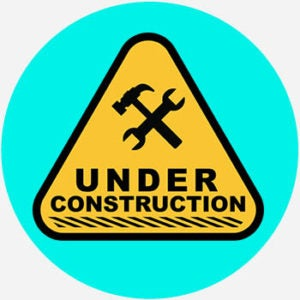

# jQuery Playground

  
    
  
   
  
   
  
   
  
   
  
  
  ## Description
  
    This is a playground for jQuery. It is a simple web page that allows you to test your jQuery code.
 
  ## Table of Contents
  - [Description](#description)
  - [Documentation](#documentation)
  - [Usage](#usage)
  - [Deployment](#deployment)
  - [Screenshot](#screenshot)
  - [Features](#features)
  - [Acknowledgements](#acknowledgements)
  - [License](#license)
  - [Testing](#testing)
  - [Contact](#contact)

  ## Documentation
  
  * jQuery <https://jquery.com/>
 
  ## Usage 
    Feel free to clone my repository and experiment with the code.

  ## Deployment

https://ratalla816.github.io/jquery-playground/

  ## Screenshot
  

  ## Features
  TBD
  
  # Acknowledgements
  
  * Traversy Media - jQuery Crash Course <https://www.youtube.com/watch?v=3nrLc_JOF7k>
    
  ## License
  
   
  Permission to use this application is granted under the MIT license. <https://opensource.org/licenses/MIT>

  ## Testing
  Not Applicable

  ## Contact:
  Holler at me! <a href="mailto:rob.atalla@robatalla816.com">rob.atalla@robatalla816.com</a>